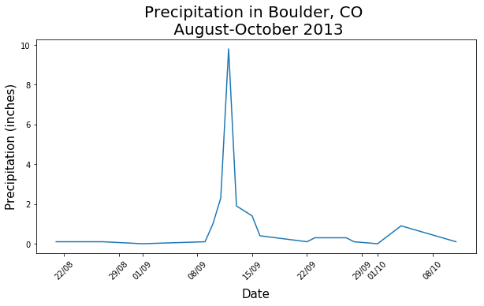
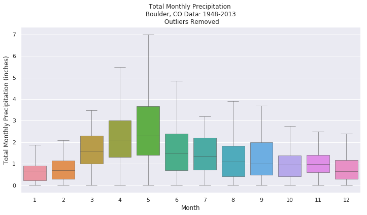

# earth-analytics

This repository contains my Jupyter notebooks that I created when completing the <a href='https://www.earthdatascience.org/courses/earth-analytics-python/'>Earth Analytics Python Course</a> from the University of Colorado. The course centres on analysing data pertaining to the Boulder, Colorado floods of 2013.

## Week 1

### 1-precipitation-august-october-2013.ipynb

This notebook creates a plot of the precipitation that fell between August - October 2013 in Boulder Colorado. 

### 2-precipitation-1948-2013.ipynb

This notebook analyses the precipitation falling in Boulder between the years 1948 to 2013. The plot below shows the distribution of total monthly precipitation for each of the calendar months. 

