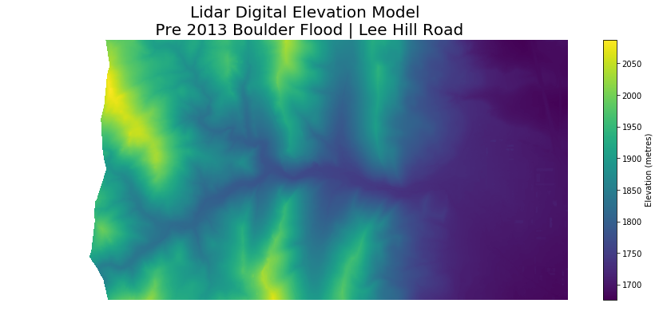
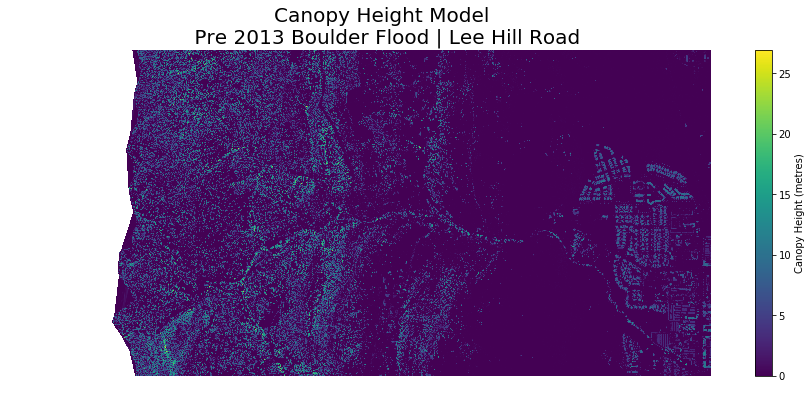

# earth-analytics

This repository contains my Jupyter notebooks that I created when completing the <a href='https://www.earthdatascience.org/courses/earth-analytics-python/'>Earth Analytics Python Course</a> from the University of Colorado. The course centres on analysing data pertaining to the Boulder, Colorado floods of 2013.

## Week 1

### 1-precipitation-august-october-2013.ipynb

This notebook creates a plot of the precipitation that fell between August - October 2013 in Boulder Colorado. 

### 2-precipitation-1948-2013.ipynb

This notebook analyses the precipitation falling in Boulder between the years 1948 to 2013. The plot below shows the distribution of total monthly precipitation for each of the calendar months. 

### 3-river-discharge-1986-2013

In this notebook, the river discharge of Boulder Creek is analysed between 1986 to 2013. The plot below shows the average daily discharge of Boulder Creek for each month between 1986 to 2013.

## Week 2

### 1-analysing-lidar-data.ipynb

This notebook creates a plot of the elevation of a surrounding area of Boulder that was affected by the September 2013 flood.  The plot is made by analysing LIDAR data to construct a Digital Elevation Model (DEM). Shown below is the DEM that is constructed.

Using a Digital Surface Model (DSM), one can construct a Canopy Height Model which depicts the height of trees and other vegetation. The CHM is shown below.

### 2-classifying-canopy-height-model.ipynb

In this notebook, the Canopy Height Model that depicts the height of the trees around Boulder is further examined. Trees are grouped into four categories depending on their height. This allows plots of tree sizes to be created. Shown below is a plot of all trees above 12 metres in the area under consideration. 

### 3-determining-change-in-elevation.ipynb

The damage of the flood can be determined by analysing the Digital Elevation Models both before and after the flood. In this notebook, a map that shows the change in elevation is created. 

